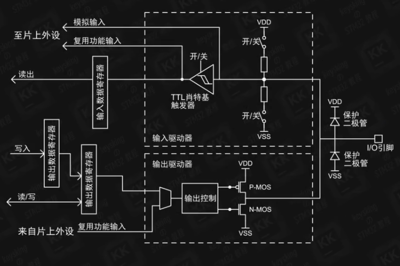
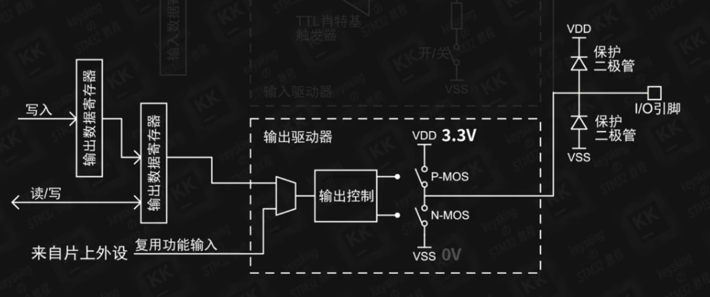
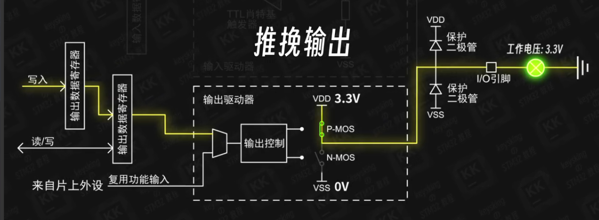
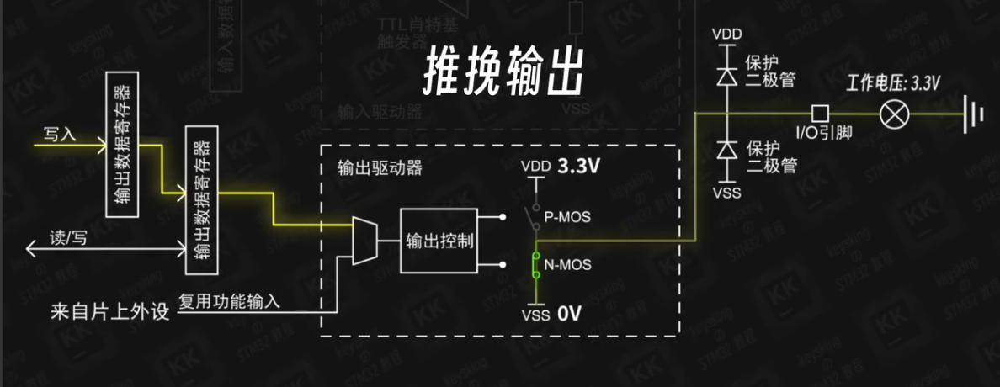
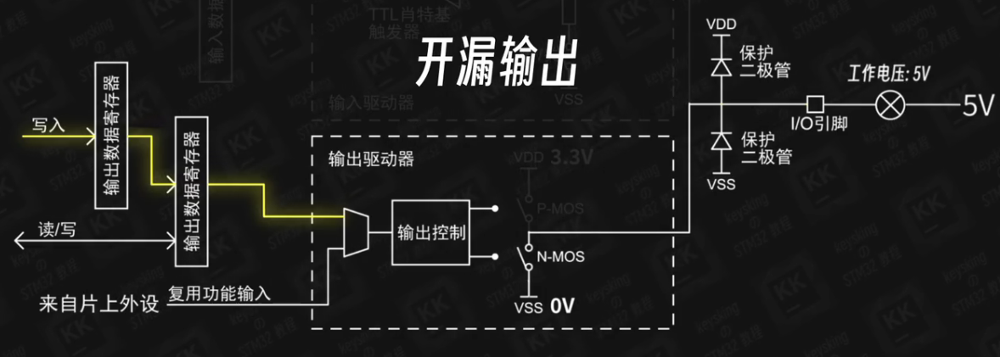
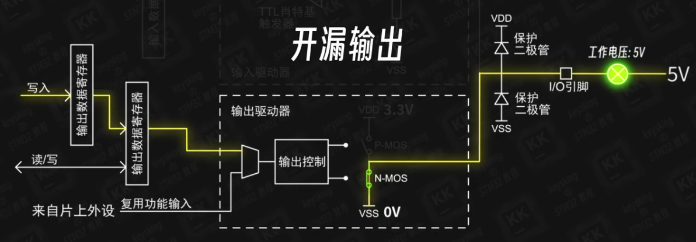
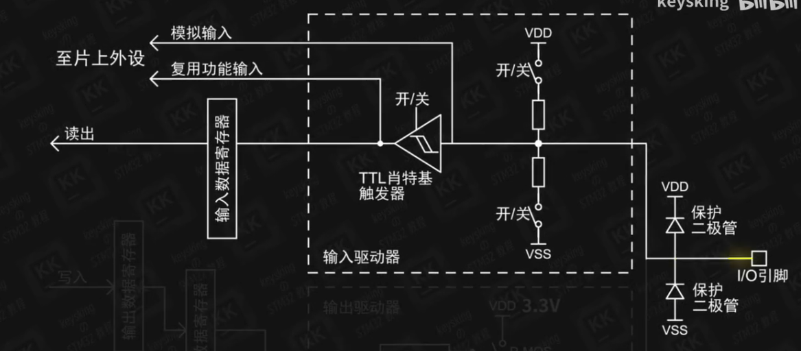

# STM32笔记
### GPIO笔记

#### IO引脚：
表现为芯片上的引脚
#### 保护二极管
**起保护作用**，芯片能够承受的电压有限，当有波动的电压进入芯片时：

**电压大于VDD 3.3V**，**VDD保护二极管导通**，将电压引入**电源网络**由电源网络吸收

**电压小于VSS 0V时**，**VSS保护二极管导通**，将电压引入**GND**，由GND网络吸收

**有一部分IO口能够承受5V**,它们的**VDD保护二极管是5V**

### 寄存器：
**寄存器**是**程序与硬件电路连接的桥梁**
按照**32位二进制数据为一组**，**存储着芯片中特定功能电路的开关信息**

**软件可以对寄存器内容进行修改**，用于**改变芯片功能电路的状态**

**软件可以读取寄存器内容**，用于**获取芯片功能电路的状态**

示例，使用代码：
```C
HAL_GPIO_WritePin(GPIOA,GPIO_PIN_7,GPIO_PIN_SET);
```
设置了**GPIO A组7号引脚（PA7）为高电平**

实际上是：
**将GPIOA_BSRR *寄存器* 的第7位设置成1**

**控制单片机就是在控制寄存器，寄存器是人机交互的底层接口**
***
### 输出模式

**这是控制输出模块**

#### 推挽输出
我们使用代码：
```C
HAL_GPIO_WritePin(GPIOA,GPIO_PIN_7,GPIO_PIN_SET);
```
**函数内部对寄存器进行了修改，使得PMOS激活，NMOS关闭，对外输出了VDD 3.3V**


我们使用代码：
```C
HAL_GPIO_WritePin(GPIOA,GPIO_PIN_7,GPIO_PIN_RESET);
```
**函数内部对寄存器进行了修改，使得PMOS关闭，NMOS激活，对外输出了VSS 0V**


**将电流推出和挽留，得名推挽模式**
***
#### 开漏输出
**开漏输出模式下只有*NMOS工作*，*PMOS一直断开***

我们使用代码：
```C
HAL_GPIO_WritePin(GPIOA,GPIO_PIN_7,GPIO_PIN_SET);
```
**PMOS不工作，NMOS断开，IO口处于断路状态**


我们使用代码：
```C
HAL_GPIO_WritePin(GPIOA,GPIO_PIN_7,GPIO_PIN_RESET);
```
**PMOS不工作，NMOS开启，形成电压差**
**外部的电流流入VSS网络，形成电流**


**开漏输出依靠外部的电压源驱动**

**可以注意到开漏输出是*低电平导通*，将相应的GPIO口设定为GPIO_PIN_RESET（低电平）才能工作**

**使用5V容忍的IO口**

| |推挽输出|开漏输出|
|-|-------|--------|
高电平|PMOS激活NMOS断开，输出VSS 3.3V|PMOS断开NMOS断开，完全由外部电路决定|
低电平|PMOS断开NMOS激活，输出VDD 0V|PMOS断开NMOS激活，外部电压流入内部|
***
#### 复用推挽输/复用开漏输出
**输入来源于片上外设，如I^2^C,串口**

***
### 输入驱动器


**上拉下拉电阻：** 内部上拉与内部下拉由这里控制
#### TTL肖特基触发器/施密特触发器： 
**稳定电平**，有**两个参考电压**
**高于参考电压，输出高电平**
**低于参考电压，输出低电平**
**两者之间，保持不变**

经过TTL的信号会**进入输入数据寄存器**
代码：
```C
HAL_GPIO_ReadPin();
```
**读取了输入数据寄存器**