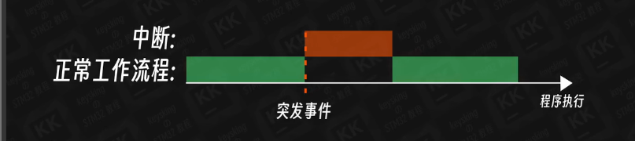
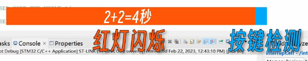
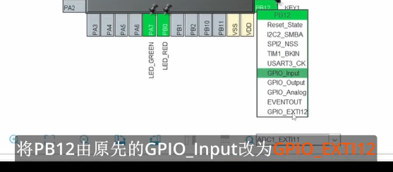
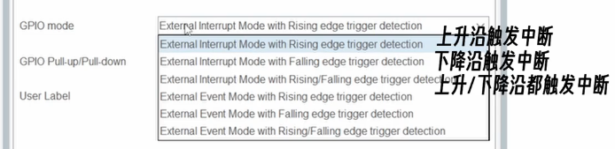
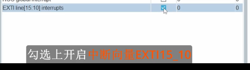
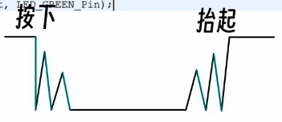
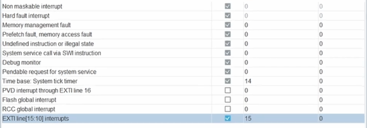

# 中断
***
## 中断的概念：
**将程序从正常的工作流程 *打断* ，进行另一流程**

**可以产生中断的操作：**
* 指令出错
* 定时器结束
* 串口接收数据
* GPIO电平变化
* 其他的操作
  ***
### 外部中断（EXTI）：
由**外部引发的**中断，通常**来自GPIO**。

**一个使用外部中断的例子：**

实现一个**按下按键切换LED灯亮灭**的程序：
***
#### 不使用中断时：
我们按照逻辑编写代码：
~~~C
//小灯连接到PA7
//按键连接到PB12，是低电平触发
while(1)
{
    HAL_GPIO_WritePin(GPIOA,GPIO_PIN_7,GPIO_PIN_SET);
    HAL_Delay(2000);
    HAL_GPIO_WritePin(GPIOA,GPIO_PIN_7,GPIO_PIN_RESET);
    HAL_Delay(2000);
    //GPIO_ReadPin()函数的返回值是GPIO_PIN_RESET，GPIO_PIN_SET的形式
    if(HAL_GPIO_ReadPin(GPIOB,GPIO_PIN_12)==GPIO_PIN_RESET)
    // HAL_GPIO_TogglePin()函数用于翻转某个GPIO的电平
    HAL_GPIO_TogglePin(GPIOA,GPIO_PIN_7)；
    //下面的while使得按键被按下时进入一个空循环
    while(HAL_GPIO_ReadPin(GPIOB,GPIO_Pin_12)==GPIO_PIN_RESET)
    {
        //啥也不干
    }
}
~~~

**但是效果并不好，只有长按不松才会在某一瞬间切换**

**问题在于`HAL_Delay()`函数**
每一次循环都会等待4000ms，而检测按钮的窗口在循环的最后面。

***
#### 使用中断：
需要手动配置一下GPIO口参数：

将PB12设定为12号中断线

进入System Core 的 GPIO 进行设置

设定为**下降沿**触发

进入**NVIC（中断控制器）：**

***
**进入代码**
`Core/Src/stm32f1xxx_it.c`
**最下面可以找到**
~~~C
void EXTI15_10_IRQHandler(void)
{
    HAL_GPIO_EXIT_IRQHandler(GPIO_EXTI12);
}
~~~
**这个函数就是触发EXTI12中断（我们设置的按键中断）后会调用的*中断处理函数***

当程序正常执行时，如果我们按下按键，下降沿被捕捉到，就会触发PB12对应的 *EXTI12中断*

就会执行所对应的**中断处理函数**也就是
~~~C
EXTI15_10_IRQHandler()；
~~~
也就是说：
**在这个函数中实现**反转小灯亮灭的函数就能实现效果

当中断函数**执行完成后会跳转回**正常的while循环。

写一下`EXTI15_10_IRQHandler()`函数：
~~~C
void EXTI15_10_IRQHandler(void)
{
    HAL_GPIO_TogglePin(GPIOA,GPIO_PIN_7)；
    HAL_GPIO_EXIT_IRQHandler(GPIO_EXTI12);
}
~~~

此时就能**基本**实现想要的效果
按键按下和抬起时会有抖动，会**产生很多个下降沿**

我们尝试在中断中加入延时，等待抖动过去
~~~C
void EXTI15_10_IRQHandler(void)
{
    HAL_Delay(10);
    if(HAL_GPIO_ReadPin(GPIOB,GPIO_PIN_12)==GPIO_PIN_RESET)
        //等待10ms再判断
        HAL_GPIO_TogglePin(GPIOA,GPIO_PIN_7)；
    HAL_GPIO_EXIT_IRQHandler(GPIO_EXTI12);
}
~~~
**然后程序就跑飞了**
**涉及到了*中断优先级*的问题**

`HAL_Delay()`依赖System tick timer（系统滴答）的**中断**，为其提供1ms的基准计时。

System tick timer（系统滴答）的**中断优先级**

**低于**

EXTI15_10中断的**优先级**

导致了`HAL_Delay()`**不能**在我们的中断函数中**正常执行**

回到NVIC，设定System tick timer（系统滴答）的**优先级数字小于**EXTI15_10的**优先级数字**

似乎优先级数字越小表示优先级越高？

**通常我们不在中断函数中实现按键逻辑，尤其避免使用延时函数**

**要尽量保证中断尽快被执行**