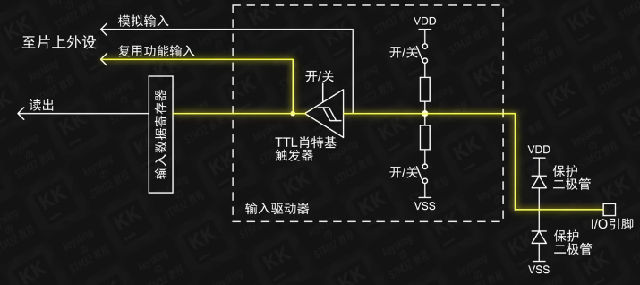
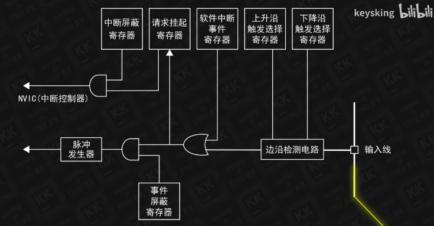
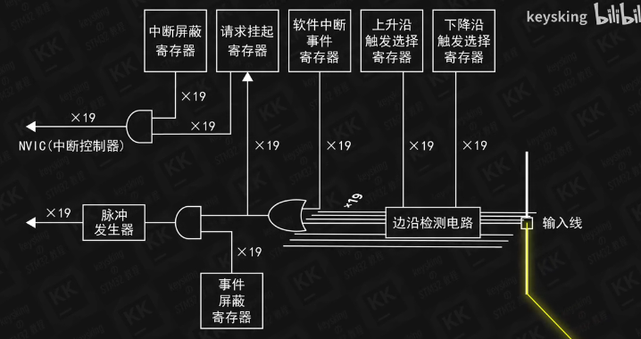
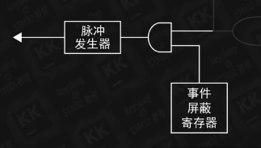
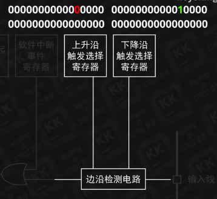
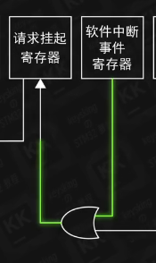
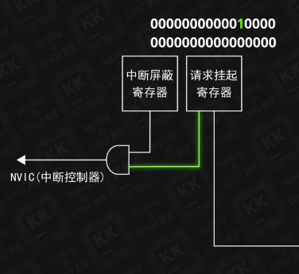
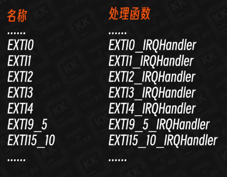

# 中断深入

**了解NVIC EXTI 中断向量 中断优先级**
***
## EXTI（外部中断）：

**电平信号在进入复用功能输入之后，还会经过一系列结构**

**这里是 *外部中断/事件控制器***
这样的结构在我们的芯片里有19个，**共用了一套寄存器**

每一个外部中断都对应着其中一组线路

前16个，EXTI0~EXTI15分别对应着预期编号相同的GPIO口

PA0 PB0 PC0 PD0 **都可以进入EXTI0**
PA1 PB1 PC1 PD1 **都可以进入EXTI1**
...

这块区域实际上和**中断无关**，是和**事件相关**
中断信号：进入处理器由代码处理
事件信号：送达相应的外设处理

检测电路**检测**信号中的**上升沿和下降沿**，由两个寄存器中的**数据决定**是否向后**发送高电平信号**
CubeMX中配置上升沿触发和下降沿触发就是在配置这两个寄存器

例子：
配置下降沿触发时
上升沿触发选择器的第12位数据配置为0
下降沿触发选择器的第12位数据配置为1

检测到下降沿信号后**经过一个或门**，抵达**请求挂起（等待）寄存器**

**软件中断事件寄存器**可以让我们通过程序，**模拟产生一个中断**（一般不用）

请求挂起寄存器是共用的，所以需要为每一个中断通道分配内存位置：接收到高电平中断信号后，会将对应的内存位**写入1**

比如我们使用的**EXTI12中断**，寄存器接收到这个中断后会将**内存的第12位写入1**

随后请求挂起寄存器会将**此位**输出到一个**与门**

**与门：**两位输入是1才输出1

所以中断屏蔽寄存器具有**最终的控制权**，它**对应的内存位置是1**才会让此中断信号**进入到NVIC**

我们设定引脚为GPIO_EXTI12时，就配置了中断屏蔽寄存器中的相应位置

**这样，来自外部的中断信号才能进入到NVIC**
***

## NVIC（嵌套向量中断控制器）
掌管着一张**中断向量表**：

中断指向中断处理函数

控制哪一个中断被触发的时候要执行哪一个中断处理函数

只有EXTI0~EXTI4有自己的中断处理函数
EXTI9~EXTI5**共享**EXTI_9_5_IRQHandler()
EXTI15~EXTI10**共享**EXTI_15_10_IRQHandler()

中断函数的跳转已经在HAL库中实现

NVIC**一直在检测**中断是否被触发
如果中断被执行后还被触发，就会**一直执行**

为了防止重复执行：
将请求挂起寄存器的**对应位写入0**

在我们写的代码中，似乎并没有看到重置寄存器的操作
~~~C
void EXTI15_10_IRQHandler(void)
{
    HAL_Delay(10);
    if(HAL_GPIO_ReadPin(GPIOB,GPIO_PIN_12)==GPIO_PIN_RESET)
        //等待10ms再判断
        HAL_GPIO_TogglePin(GPIOA,GPIO_PIN_7)；
    HAL_GPIO_EXIT_IRQHandler(GPIO_EXTI12);
}
~~~
其实
`HAL_GPIO_EXIT_IRQHandler(GPIO_EXTI12)`;
的实现中：
~~~C
void HAL_GPIO_EXTI_IRQHandler(uint16_t GPIO_Pin)
{
  /* EXTI line interrupt detected */
  if (__HAL_GPIO_EXTI_GET_IT(GPIO_Pin) != 0x00u)
  {
    __HAL_GPIO_EXTI_CLEAR_IT(GPIO_Pin);
    HAL_GPIO_EXTI_Callback(GPIO_Pin);
  }
}
~~~
其中的
~~~C
__HAL_GPIO_EXTI_CLEAR_IT(GPIO_Pin);
~~~
将我们传入的`GPIO_Pin`参数传了进去，这个函数就是**清除对应位的请求挂起寄存器**的函数

### 中断优先级：
中断向量的优先级分为两层：
* 抢占优先级
* 响应优先级

##### 当两个中断同时发生时：
* **首先判断**两个中断向量的**抢占优先级**，**抢占优先级更高（所设定的优先级数字更小）的先执行**，之后执行抢占优先级更小的

**两个中断的抢占优先级相同：**
* **响应优先级更高（所设定的优先级数字更小）** 的中断先执行

**两个中断的抢占优先级和响应优先级都相同：**
* **按照在中断向量表中的顺序决定**

##### 两个中断先后到达：
* **只会比较两个中断的抢占优先级**
* **抢占优先级更高的会打断原先中断并执行**
* **执行完成后再执行被打断的中断**  

中断优先级由四位二进制数据控制

抢占优先级和中断优先级**共用**四位二进制数据

可以设定几位用于抢占优先级，几位用于中断优先级
***
**各种外设也可以触发各种中断**
有各自的中断屏蔽寄存器，请求挂起寄存器