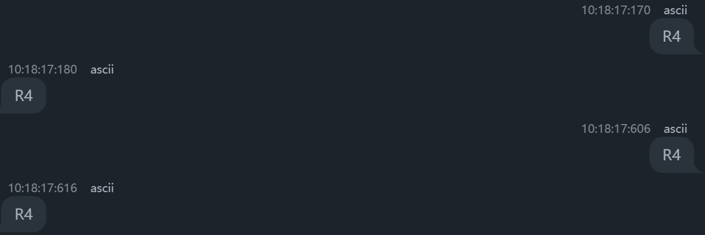

# 串口 - 轮询模式
***
常见的串口类型RS-232、RS-485，网线的RJ-45接口，在**嵌入式中常用UART（通用异步收发传输器）**，**在单片机中**UART串口常用TTL电平通信，所以**UART串口和TTL串口等同**
## TTL串口：
**TTL（晶体管-晶体管逻辑）**：TTL是一种电平标准，通常指的是0V和5V（或3.3V）的电压范围。TTL电平常用于短距离、低速率的通信。

**TTL串口仅需要两根数据线就可以完成双向通信**，通常是全双工的，这意味着它可以同时进行发送和接收数据。

***
### 通信模式:

#### 单工（Simplex）
- **定义**：数据只能在一个方向上传输。
- **示例**：电视广播，数据只能从广播站传输到电视机，不能反向传输。

#### 半双工（Half-Duplex）
- **定义**：数据可以在两个方向上传输，但不能同时进行。通信双方需要轮流发送和接收数据。
- **示例**：对讲机，用户A和用户B不能同时讲话，需要轮流按下通话按钮。

#### 全双工（Full-Duplex）
- **定义**：数据可以在两个方向同时传输。通信双方可以同时发送和接收数据。
- **示例**：电话通话，双方可以同时讲话和听到对方的声音。

#### 异步全双工（Asynchronous Full-Duplex）
- **定义**：数据在两个方向上同时传输，并且发送和接收数据的时钟信号是独立的，不需要同步。
- **示例**：UART串口通信，发送和接收数据流是独立的，且不需要共享时钟信号。
***
### RX和TX

在串口通信中，RX和TX是两个关键的引脚：

- **RX（Receive）**：接收数据引脚，用于接收从其他设备发送过来的数据。
- **TX（Transmit）**：发送数据引脚，用于发送数据到其他设备。

在UART通信中，需要**将一个设备的TX引脚连接到另一个设备的RX引脚**，以实现数据的正确传输和接收。
***
### TTL通信中的共地

在TTL通信中，共地（Common Ground）是一个非常重要的概念。共地是指通信双方的地线（GND）连接在一起，以确保它们有一个共同的参考电压。

#### 为什么需要共地？

1. **电压参考一致**：共地确保两个设备的电压参考一致，从而保证信号电平的正确识别。
2. **减少噪声**：共地可以减少由于电压差异引起的噪声，从而提高通信的可靠性。
3. **保护电路**：共地可以防止由于电压不一致引起的电流冲击，保护电路不受损坏。

#### 如何实现共地？

在实际连接中，需要将两个设备的GND引脚连接在一起。例如，在使用UART进行TTL通信时，需要连接如下引脚：

- 设备A的**TX连接到**设备B的**RX**
- 设备A的**RX连接到**设备B的**TX**
- 设备A的**GND连接到**设备B的**GND**

***
## 实战环节：
### 总目标：做一个电脑控制STM32的小灯亮灭程序

**指令样式为两个字节：第一个字节控制想要的小灯，第二个字节控制亮灭**
**收到指令后要回复当前的指令**
~~~c
//R,G,B代表控制的小灯
//1,0代表亮灭
char com[2]="R1"
com[0]=R//代表控制红色小灯
com[1]=1//代表亮
~~~

**首先进入CubeMX设置：**
1. 打开connective，启用USART2 
2. 配置波特率
3. 配置停止位
4. （以上步骤一般默认）

#### 波特率（Baud Rate）

波特率是指在串行通信中，每秒钟传输的符号（信号变化）的次数。它是衡量数据传输速度的一个重要参数，通常以每秒波特数（bps, bits per second）表示。

#### 常见的波特率值

在串口通信中，常见的波特率值有：
- 9600 bps
- 19200 bps
- 38400 bps
- 57600 bps
- 115200 bps

**两个设备需要保持相同的波特率才能正常通信**

**TTL串口每次传递一个字节（Byte）是8bit数据**

但是要加上一个起始位和一个停止位，所以是10bit数据
***
**我们首先实现一下每秒向电脑发送“Hello World”的程序**
~~~C
 /* USER CODE BEGIN 2 */
char message[]="Hello world";
  /* USER CODE END 2 */

  /* Infinite loop */
  /* USER CODE BEGIN WHILE */
  while (1)
  {
      HAL_UART_Transmit(&huart2, (uint8_t*)message, strlen(message), HAL_MAX_DELAY);
        HAL_Delay(1000);
    /* USER CODE END WHILE */

    /* USER CODE BEGIN 3 */
  }
~~~

**进入`HAL_UART_Transmit()`函数：**
~~~C
HAL_StatusTypeDef HAL_UART_Transmit(UART_HandleTypeDef *huart, const uint8_t *pData, uint16_t Size, uint32_t Timeout)
~~~
其中要求一个unit8_t的pData指针，char已经是指针了，而且也是8位
##### uint8_t：

`uint8_t` 是一种数据类型，表示无符号的8位整数。它是C和C++标准库中的一种类型定义，通常在嵌入式系统和低级编程中使用。

接下来就可以连接到电脑看看效果

使用[串口调试助手](https://serial.keysking.com/)

***
**接下来实现向电脑发送数据：**
~~~C
/* USER CODE BEGIN 2 */
  uint8_t com[2];
  /* USER CODE END 2 */

  /* Infinite loop */
  /* USER CODE BEGIN WHILE */
  while (1)
  {
        HAL_UART_Receive(&huart2, com, 2, HAL_MAX_DELAY);
        HAL_UART_Transmit(&huart2, com, 2, HAL_MAX_DELAY);
        // HAL_Delay(1000);如果启用这行会导致接收数据错乱
    /* USER CODE END WHILE */

    /* USER CODE BEGIN 3 */
  }
~~~

***
**接下来完整实现：**
~~~C
/* USER CODE BEGIN 2 */
  uint8_t com[2];
  /* USER CODE END 2 */

  /* Infinite loop */
  /* USER CODE BEGIN WHILE */
  while (1)
  {
        HAL_UART_Receive(&huart2, com, 2, HAL_MAX_DELAY);
        HAL_UART_Transmit(&huart2, com, 2, HAL_MAX_DELAY);
        GPIO_PinState state = GPIO_PIN_RESET;
      if (com[1] == '1')
      {
          state = GPIO_PIN_SET;
      }
      if (com[0]=='R')
      {
          HAL_GPIO_WritePin(LED_RED_GPIO_Port, LED_RED_Pin, state);
      } else if (com[0]=='G')
      {
          HAL_GPIO_WritePin(LED_GREEN_GPIO_Port, LED_GREEN_Pin, state);
      } else if (com[0]=='B')
      {
          HAL_GPIO_WritePin(LED_BULE_GPIO_Port, LED_BULE_Pin, state);
      }
  }
~~~

其中`GPIO_PinState state = GPIO_PIN_RESET;`中
`PIO_PinState`是`HAL_GPIO_ReadPin`的返回值
可以是
`GPIO_PIN_SET`
`GPIO_PIN_RESET`

GitHub提交测试