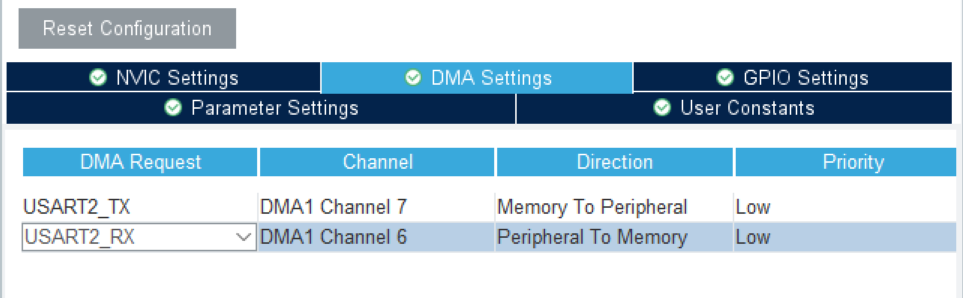
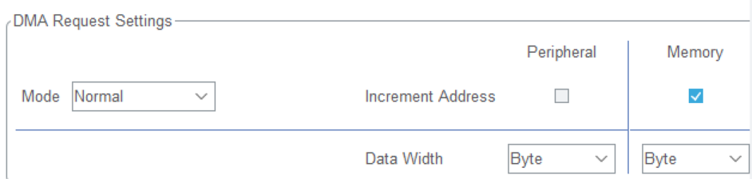

# 串口接收不定长数据和DMA
***
在串口中断模式下，每次**接收和发送**一个字节的数据都会触发一次发送数据寄存器空的中断，这样就会导致中断频繁的发生，影响系统的性能。为了提高系统的性能，**可以使用DMA模式**来接收和发送数据。DMA模式是直接内存访问模式，可以在不经过CPU的情况下，直接在外设和内存之间传输数据。这样就可以减少CPU的负担，提高系统的性能。

#### CubeMX中配置DMA模式的步骤：
1. 在`CubeMX/USART2`中**开启DMA**
2. 为TX和RX配置DMA通道
3. 剩下的参数已经自动配置

#### 参数解析：
- Channel（通道）：选择DMA的通道
- Direction(方向)：内存到外设或外设到内存
- Priority（优先级）：可以设定低和高
- Increment Address（数据地址自增）：寄存器只有一字节不需要自增，而内存中需要一次搬运，所以内存要勾选自增
- Data Width（数据宽度）：我们每次发送都是一字节，默认一字节就可以
***
DMA模式下的代码很简单，只需要把后缀_IT改成_DMA
~~~C
HAL_UART_Transmit_IT(&huart2, com, 2);
//改成
HAL_UART_Transmit_DMA(&huart2, com, 2);

HAL_UART_Receive_IT(&huart2, com, 2);
//改成
HAL_UART_Receive_DMA(&huart2, com, 2);
~~~

即使使用了DMA模式，还是有中断参与其中的，比如RxCpltCallback()函数，这时这个中断不再是串口的中断，而是DMA中断。

### 接收不定长数据：
接收不定长数据的原理还是依靠中断，主要靠的是串口空闲（IDLE）中断。串口空闲中断的触发条件与接收到的字节数无关，只有当RX引脚没有后续数据进入时，也就是串口从忙碌转为空闲的时候才会触发。

所以我们可以认为空闲中断发生时，就是一帧数据接收完成的时候，在此时对数据进行分析处理即可。

我们将串口接收函数替换为HAL库为我们提供的一个扩展函数：
~~~C
HAL_UARTx_ReceiveToIdle_DMA(&huart2, com, 50);
~~~
`ReceiveToIdle`函数也有阻塞、中断、DMA三个版本，这里使用DMA版本。

这里的第三个参数不是我们要接收的数据长度，而是我们一次能够接收的最大数据长度，这里设置为50。

`HAL_UARTx_ReceiveToIdle_DMA()`函数对应的回调函数不再是之前的`HAL_UART_RxCpltCallback()`

我们进入到`stm32f1xx_it.c`文件中，找到`USART2_IRQHandler()`函数，进入到`stm32f1xx_hal_uart.c`文件中，找到HAL_UARTEx_RxEventCallback()函数:
~~~C
__weak void HAL_UARTEx_RxEventCallback(UART_HandleTypeDef *huart, uint16_t Size)
{
  /* Prevent unused argument(s) compilation warning */
  UNUSED(huart);
  UNUSED(Size);

  /* NOTE : This function should not be modified, when the callback is needed,
            the HAL_UARTEx_RxEventCallback can be implemented in the user file.
   */
}
~~~

这也是一个弱定义函数，我们可以在main.c文件中重新定义

`HAL_UARTEx_RxEventCallback()`函数和`HAL_UART_RxCpltCallback()`对比，多了一个入参size，这是因为之前我们知道接收的数据长度，而这里我们不知道，所以需要传入一个参数。

我们编写代码：
~~~C
void HAL_UARTEx_RxEventCallback(UART_HandleTypeDef *huart, uint16_t Size)
{
    if（huart == &huart2）//判断是哪个串口
    {   
        HAL_UART_Transmit_DMA(&huart2, com, Size);//将接收到的数据发送出去

        HAL_UARTx_ReceiveToIdle_DMA(&huart2, com, sizeof(com));//再次开启DMA接收
    }
}    
~~~
使用DMA模式，“传输过半”也会触发RxEventCallback()函数，所以我们需要关闭“传输过半中断”：
~~~C
void HAL_UARTEx_RxEventCallback(UART_HandleTypeDef *huart, uint16_t Size)
{
    if（huart == &huart2）//判断是哪个串口
    {   
        HAL_UART_Transmit_DMA(&huart2, com, Size);//将接收到的数据发送出去
        __HAL_DMA_DISABLE_IT(&hdma_usart2_rx,DMA_IT_HT);
        HAL_UARTx_ReceiveToIdle_DMA(&huart2, com, sizeof(com));//再次开启DMA接收
    }
}    
~~~
这样就可以实现接收不定长数据的功能了。